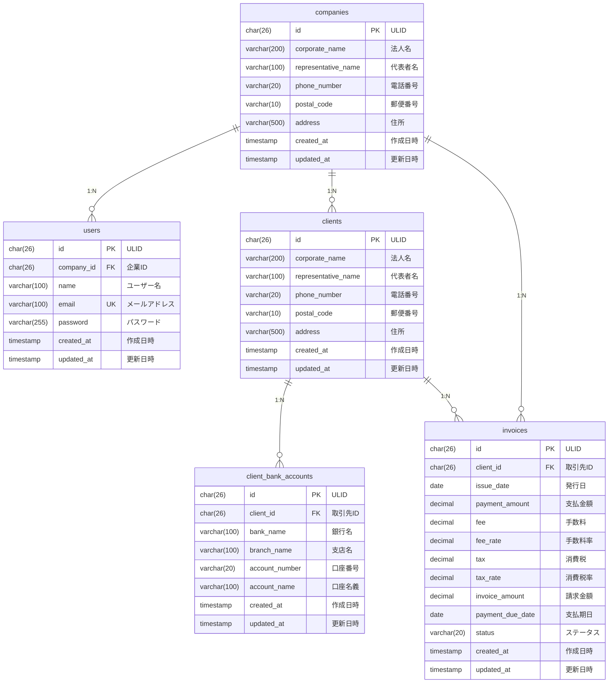

# practice-202512

「スーパー支払い君.com」のコーディングテストプロジェクトです。

## API エンドポイント

### 認証
- `POST /api/login` - ログイン（JWT認証トークン取得）

### 請求書
- `POST /api/invoices` - 請求書データ作成（JWT認証必須）
- `GET /api/invoices` - 請求書データ取得（JWT認証必須）

## ディレクトリ構成

```
practice-202512/
├── compose.yml                          # Docker Compose設定ファイル
├── Dockerfile                           # APIコンテナのDockerfile
├── .air.toml                            # Airの設定ファイル（ホットリロード）
├── .env.sample                          # 環境変数のサンプルファイル
├── .mockery.yml                         # Mockery設定ファイル
├── .gitignore                           # Git除外設定
├── Makefile                             # Make コマンド定義
├── go.mod                               # Go モジュール定義
├── go.sum                               # Go 依存関係チェックサム
├── main.go                              # アプリケーションエントリーポイント
│
├── app/                                 # アプリケーションコード
│   ├── config/                          # 設定管理
│   │   └── config.go                    # 環境変数から設定を読み込み
│   │
│   ├── domain/                          # ドメイン層
│   │   ├── models/                      # エンティティ
│   │   │   ├── user.go                  # Userエンティティ
│   │   │   ├── company.go               # Companyエンティティ
│   │   │   ├── client.go                # Clientエンティティ
│   │   │   ├── client_bank_account.go   # ClientBankAccountエンティティ
│   │   │   └── invoice.go               # Invoiceエンティティ
│   │   │
│   │   ├── repository/                  # リポジトリインターフェース
│   │   │   ├── user_repository.go       # UserRepositoryインターフェース
│   │   │   ├── company_repository.go    # CompanyRepositoryインターフェース
│   │   │   ├── client_repository.go     # ClientRepositoryインターフェース
│   │   │   ├── client_bank_account_repository.go  # ClientBankAccountRepositoryインターフェース
│   │   │   ├── invoice_repository.go    # InvoiceRepositoryインターフェース
│   │   │   └── mocks_test.go            # モックファイル（自動生成）
│   │   │
│   │   └── value/                       # 値オブジェクト
│   │       └── invoice_status.go        # 請求書ステータス
│   │
│   ├── usecase/                         # ユースケース層（ビジネスロジック）
│   │   ├── auth_usecase.go              # 認証関連のユースケース
│   │   ├── auth_usecase_test.go         # 認証ユースケースのテスト
│   │   ├── invoice_usecase.go           # 請求書関連のユースケース
│   │   ├── invoice_usecase_test.go      # 請求書ユースケースのテスト
│   │   └── mocks_test.go                # モックファイル（自動生成）
│   │
│   ├── infrastructure/                  # インフラ層（DB実装・外部依存）
│   │   └── database/                    # データベース関連
│   │       ├── connection.go            # GORM データベース接続
│   │       ├── entities/                # データベースエンティティ
│   │       │   ├── user.go              # User Entity
│   │       │   ├── company.go           # Company Entit
│   │       │   ├── client.go            # Client Entit
│   │       │   ├── client_bank_account.go  # ClientBankAccount Entit
│   │       │   └── invoice.go           # Invoice Entit
│   │       │
│   │       └── gateway/                 # リポジトリ実装
│   │           ├── user_repository.go   # UserRepository のGORM実装
│   │           ├── user_repository_test.go  # UserRepositoryのテスト
│   │           ├── company_repository.go    # CompanyRepository のGORM実装
│   │           ├── company_repository_test.go  # CompanyRepositoryのテスト
│   │           ├── client_repository.go     # ClientRepository のGORM実装
│   │           ├── client_repository_test.go  # ClientRepositoryのテスト
│   │           ├── client_bank_account_repository.go  # ClientBankAccountRepository のGORM実装
│   │           ├── client_bank_account_repository_test.go  # ClientBankAccountRepositoryのテスト
│   │           ├── invoice_repository.go    # InvoiceRepository のGORM実装
│   │           └── invoice_repository_test.go  # InvoiceRepositoryのテスト
│   │
│   ├── presentation/                    # プレゼンテーション層（HTTP）
│   │   ├── router.go                    # ルーティング設定
│   │   ├── handler/                     # HTTPハンドラー
│   │   │   ├── auth_handler.go          # 認証関連のハンドラー
│   │   │   ├── auth_handler_test.go     # 認証ハンドラーのテスト
│   │   │   ├── invoice_handler.go       # 請求書関連のハンドラー
│   │   │   └── invoice_handler_test.go  # 請求書ハンドラーのテスト
│   │   │
│   │   ├── middleware/                  # ミドルウェア
│   │   │   ├── db_middleware.go         # DBコンテキストミドルウェア
│   │   │   ├── jwt_middleware.go        # JWT認証ミドルウェア
│   │   │   └── validator.go             # バリデーター
│   │   │
│   │   └── models/                      # プレゼンテーション層のモデル
│   │       └── invoice.go               # 請求書のリクエスト/レスポンス
│   │
│   └── util/                            # ユーティリティ
│       ├── context.go                   # コンテキスト関連ユーティリティ
│       ├── jwt.go                       # JWT関連ユーティリティ
│       └── ulid.go                      # ULID生成ユーティリティ
│
├── e2e/                                 # E2Eテスト
│   └── e2e_test.go                      # エンドツーエンドテスト
│
└── tool/                                # ツール
    └── seed/                            # シードデータ
        └── main.go                      # テストデータ作成ツール
```

## クリーンアーキテクチャの層

1. **domain層**: ビジネスルールとエンティティを定義。他の層に依存しない。
   - `models/`: ドメインモデル（エンティティ）定義
   - `repository/`: リポジトリのインターフェース定義
   - `value/`: 値オブジェクト定義
2. **usecase層**: アプリケーションのビジネスロジックを実装。domainに依存。
3. **infrastructure層**: データベースや外部APIなどの実装。domainに依存。
   - `database/entities/`: GORMを使用したエンティティオブジェクト
   - `database/gateway/`: リポジトリインターフェースの実装
4. **presentation層**: HTTPハンドラーやルーター。usecaseに依存。
   - `handler/`: HTTPリクエストハンドラー
   - `middleware/`: ミドルウェア
   - `models/`: リクエスト/レスポンスモデル
5. **config層**: 環境変数からの設定読み込み。

## セットアップ

### 前提条件

- Docker
- Docker Compose
- Make

### 起動手順

1. **環境変数ファイルの作成**

```bash
make init
```

`.env.sample` から `.env` ファイルが作成されます。必要に応じて `.env` の内容を編集してください。

2. **アプリケーションの起動**

```bash
make up-build
```

初回起動時はイメージのビルドが行われます。

3. **テストデータの作成**

```bash
make seed
```

テストデータ（会社、ユーザー、クライアント、請求書）が作成されます。

4. **動作確認**

```bash
curl http://localhost:8080/api/login \
  -H "Content-Type: application/json" \
  -d '{"email":"admin@localhost.ai","password":"password"}'
```

JWT トークンが返却されれば成功です。

## Makefileコマンド

### Docker関連

| コマンド             | 説明                                 |
|------------------|------------------------------------|
| `make init`      | `.env.sample` から `.env` ファイルを作成します |
| `make up`        | Docker Composeでコンテナを起動します（デタッチモード） |
| `make down`      | Docker Composeでコンテナを停止します          |
| `make restart`   | Docker Composeでコンテナを再起動します         |
| `make build`     | Docker Composeでイメージをビルドします         |
| `make up-build`  | イメージをビルドしてからコンテナを起動します             |
| `make logs`      | コンテナのログをリアルタイムで表示します               |
| `make ps`        | 実行中のコンテナの状態を確認します                  |
| `make clean`     | コンテナとボリュームを削除します（データも削除されます）       |
| `make api-shell` | APIコンテナのシェルに接続します                  |
| `make db-shell`  | MySQLコンテナに接続します                    |

### 開発関連

| コマンド         | 説明                   |
|--------------|----------------------|
| `make seed`  | テストデータを作成します         |
| `make mock`  | Mockファイルを作成します       |

### テスト関連

| コマンド                     | 説明                        |
|--------------------------|---------------------------|
| `make test`              | 全テスト実行                    |
| `make test-unit`         | 単体テスト実行（e2e以外）            |
| `make test-e2e`          | E2Eテスト実行                  |

### その他

| コマンド         | 説明             |
|--------------|----------------|
| `make help`  | ヘルプを表示します      |

## 開発

### コードの自動リロード

Airを使用しているため、コードを変更すると自動的にアプリケーションが再起動されます。

### ログの確認

```bash
make logs
```

### APIコンテナへのアクセス

```bash
make api-shell
```

### データベースへのアクセス

```bash
make db-shell
```

### テストの実行

```bash
# 単体テストのみ実行
make test

# E2Eテストのみ実行
make test-e2e

```

### モックファイルの生成

```bash
make mock
```

リポジトリやユースケースのインターフェースからモックファイルを自動生成します。

## API使用例

### 1. ログイン

```bash
curl -X POST http://localhost:8080/api/login \
  -H "Content-Type: application/json" \
  -d '{
    "email": "admin@localhost.ai",
    "password": "password"
  }'
```

レスポンス:
```json
{
  "token": "eyJhbGciOiJIUzI1NiIsInR5cCI6IkpXVCJ9..."
}
```

### 2. 請求書作成

```bash
# 環境変数にトークンを設定
TOKEN="取得したJWTトークン"

curl -X POST http://localhost:8080/api/invoices \
  -H "Content-Type: application/json" \
  -H "Authorization: Bearer ${TOKEN}" \
  -d '{
    "client_id": "01HQZXFG0PJ9K8QXW7YM1N2ZXC",
    "issue_date": "2025-01-01",
    "payment_amount": 100000,
    "payment_due_date": "2025-02-01"
  }'
```

レスポンス:
```json
{
  "id": "01HQZXFG0PJ9K8QXW7YM1N2ZXD",
  "client_id": "01HQZXFG0PJ9K8QXW7YM1N2ZXC",
  "issue_date": "2025-01-01T00:00:00Z",
  "payment_amount": "100000",
  "fee": "4000",
  "fee_rate": "0.04",
  "tax": "400",
  "tax_rate": "0.10",
  "invoice_amount": "104400",
  "payment_due_date": "2025-02-01T00:00:00Z",
  "status": "未処理",
  "created_at": "2025-12-21T10:00:00Z",
  "updated_at": "2025-12-21T10:00:00Z"
}
```

### 3. 請求書一覧取得

#### 全件取得（デフォルト: offset=0, limit=100）

```bash
curl -X GET http://localhost:8080/api/invoices \
  -H "Authorization: Bearer ${TOKEN}"
```

#### 日付範囲で取得

```bash
curl -X GET "http://localhost:8080/api/invoices?start_date=2025-01-01&end_date=2025-12-31" \
  -H "Authorization: Bearer ${TOKEN}"
```

#### ページネーション

```bash
# offset=10, limit=20で取得
curl -X GET "http://localhost:8080/api/invoices?offset=10&limit=20" \
  -H "Authorization: Bearer ${TOKEN}"
```

#### 日付範囲とページネーションの組み合わせ

```bash
curl -X GET "http://localhost:8080/api/invoices?start_date=2025-01-01&end_date=2025-12-31&offset=0&limit=50" \
  -H "Authorization: Bearer ${TOKEN}"
```

レスポンス:
```json
[
  {
    "id": "01HQZXFG0PJ9K8QXW7YM1N2ZXD",
    "client_id": "01HQZXFG0PJ9K8QXW7YM1N2ZXC",
    "issue_date": "2025-01-01T00:00:00Z",
    "payment_amount": "100000",
    "fee": "4000",
    "fee_rate": "0.04",
    "tax": "400",
    "tax_rate": "0.10",
    "invoice_amount": "104400",
    "payment_due_date": "2025-02-01T00:00:00Z",
    "status": "unprocessed",
    "created_at": "2025-12-21T10:00:00Z",
    "updated_at": "2025-12-21T10:00:00Z"
  }
]
```

## ER図



## 技術スタック

- **言語**: Go 1.25
- **Webフレームワーク**: Echo v4
- **ORM**: GORM v1.25
- **データベース**: MySQL 8.0
- **認証**: JWT (golang-jwt)
- **バリデーション**: go-playground/validator
- **テスト**: testify, mockery
- **ホットリロード**: Air
- **コンテナ**: Docker & Docker Compose

## テスト

プロジェクトには以下のテストが含まれています：

- **単体テスト**: Gateway層、Usecase層、Handler層
- **E2Eテスト**: ログインから請求書作成・取得までの一連のフロー

各テストは独立して実行可能で、Gateway層はSQLiteインメモリDBを使用し、Usecase層とHandler層はmockeryで生成したモックを使用しています。

## ライセンス

MIT
